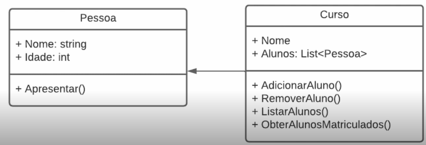

# Curso de C# da Dio.me - Modulo de propriedades, metodos e construtores

## Criando uma classe e a sua propriedade na pratica

    1.  Foi criado uma pastal 'Model', na qual estara contido todas as classes utilizados no projeto;
    2.  Com o botao direito, crie um arquivo 'Class' e de uma nome para ele;
    3.  Escreva dentro da linha de programacao 'prop' e de 'enter', coloque o 'type' das variaveis que vc ira utilziar e o se 'nome'. 

    Obs: A propriedade tem get e set, ou um dos dois;

## Criando um metodo
    Metodo e uma acao que existira dentro da sua classe.

    Dentro do 'Public class' escreva 'public void 'nome do metodo'' e depois o que o metodo ira fazer.

    Ex.:
            public void Apresentar()
        {
            Console.WriteLine($"Printe no temrinal o nome e a idade da pessoa x - Nome: {Nome}, Idade {Idade}");
        } 

 Na imagem abaixo mostra outra forma de saber o que e propriedade e o que e metodo.
    
* Metodo e representado pelo cubo;
* Propriedade e representado pela chave.

 
 
 
 ## Validando propriedade
    1. Assim como esta mostrando na imagem abaixo, sera inicializado uma variavel que tera o valor do get e set;
    2. Depois vazer a validacao dentro do get e set;

A validacao nesse caso so funciona, pois as variaveis '_nome' e '_idade' so sao instanciadas assim que passarem pelo 'if' que estara validando o valor que sera inputado nelas;

Assim como esta mostrando na figura abaixo:

Validacao para a propriedade nome
  

Validacao para a propriedade idade
  

### Validacao feita com Body Expressions
     

## O que sao as palavras 'public' e ' private' nas nossas classes
    A funcao da palavra 'ppublic' dentro das nossas classes tem o dignificado de que, qualquer um pode acessar essa classe, qualquer um pode instanciar essa propriedade, a classe tambem;
    
    Ja o 'private' so pode ser acessado dentro da classe, quando no caso a propriedade tiver com alguma variavel inicializada com 'private'. Quem pode acessa-la e so a classe onde ela estara localizada;

    Um exemplo seria se fosse feita a tentativa de instanciar a variavel '_nome' e '_idade' no programa alem da classe, a imagem abaixo estara mostrando que essa variavel nao aparece na linha do programa.

 

## Propriedade que contem apenas o get

Obs: **get = leitura**

    O exemplo abaixo ira mostrar o uso de uma propriedade apenas com o get;
    Foi criado uma classe Pessoa com os atributos 'Nome', 'Sobrenome' e 'nomeCompleto';
    'Nome' e 'Sobrenome' sao propriedades com get e set, mas 'nomeCompleto' esta apenas com o get;

        namespace ExemploExplorando.Models
{
    public class Pessoa
    {
        private string _nome;

        public string Sobrenome { get; set; }

        public string nomeCompleto => $"{Nome}{Sobrenome}";

        public string Nome
        {
            get
            {
                return _nome.ToUpper();
            }

            set
            {
                if (value == "")
                {
                    throw new ArgumentException("O nome nao pode ser vazio");
                }

                _nome = value;

            }
        }
        
    }

        public void Apresentar()
        {
            Console.WriteLine($"Nome: {Nome} {Sobrenome} ou {nomeCompleto}");
        }
    }
}
    
nomeCompleto com apenas get

 

## Metodo na programacao

    Metodo() = (é a ação que a classe irá fazer)
    
    A classe basicamente e composta por atributo e metodo;
  
 

Obs: retorno com void, eh um retorno vazio;
Obs: retorno com int, por exempplo, precisa utilizar o 'return', pois tem uma variavel que podera ser retornada;

Obs: exemplo de codigo dde metodo quando trabalho com lista:
            
            public void adicionarAluno(Pessoa aluno)
        {
            Alunos.Add(aluno);
        }

        explicando, nesse caso que 'adicionarAluno' e o nome do metodo;
        '(Pessoa aluno)' se trada do tipo da varaivel e o nome que reppesenta essa variavel, no caso, type = Pessoa e name = aluno;

        Dentro do metodo chamamos de argumento ou parametros;

## Construtor

    Um construtor é um método cujo nome é igual ao nome de seu tipo. Sua assinatura do método inclui apenas um modificador de acesso opcional, o nome do método e sua lista de parâmetros; ela não inclui tipo de retorno.

    Nos programas que eu fiz, os atributos tem retorno, exemplo o atributo abaixo que tem retorno em string:

     public string Nome
        {
            get
            {
                return _nome.ToUpper();
            }

            set
            {
                if (value == "")
                {
                    throw new ArgumentException("O nome nao pode ser vazio");
                }

                _nome = value;

            }
        }

    Os construtores nao tem retorno e carregam o mesmo nome da sua classe.
    Por enquanto aprendi que os construtores servem para ser passados valores padroes da classe.
    Podem ser criados quantos construtores quiser.

 

    Foram criados dois construtores.
    No meu programa principal, agora aparece como sujestao qual construtor eu posso utilizar quando vou inicializar um objeto.

Construtor sem parametro

 
    
Construtor com parametro

 

